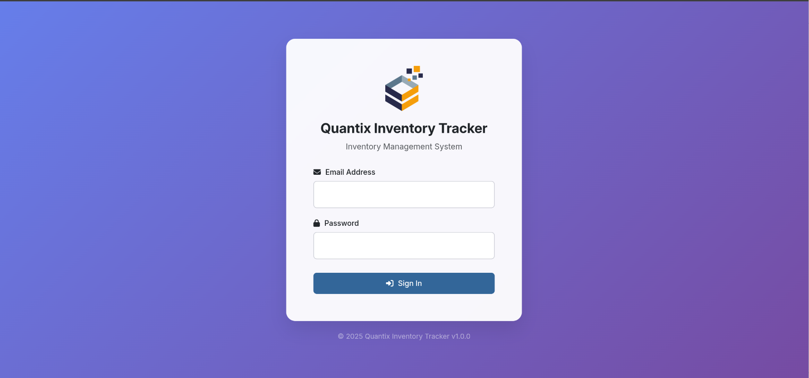
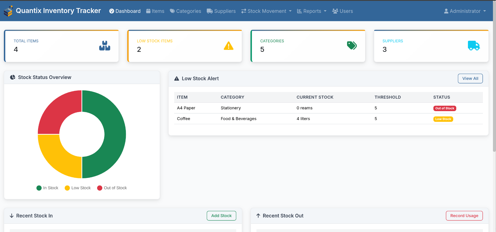
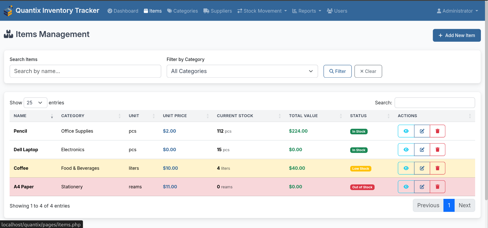
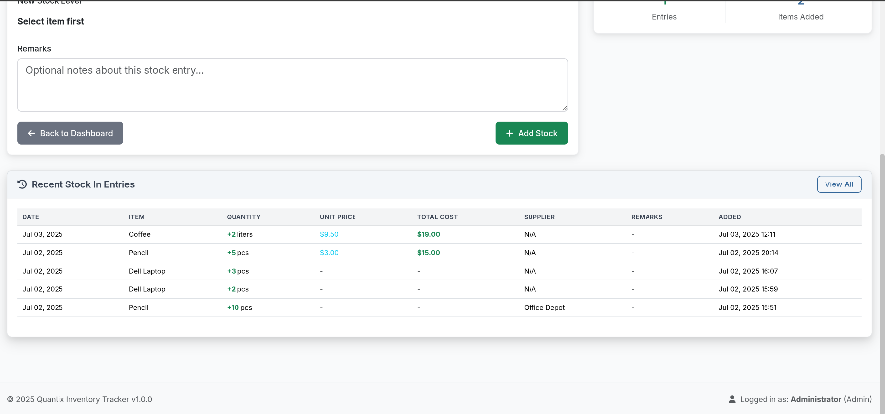
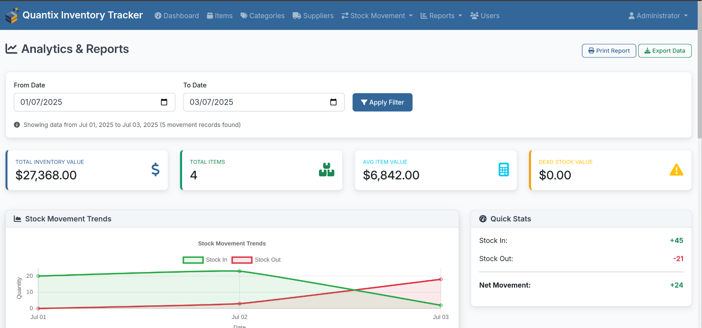
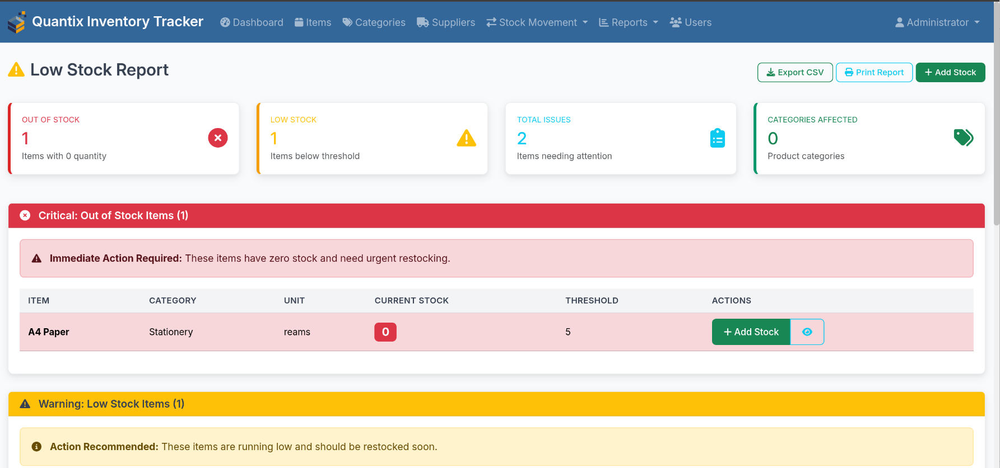

# Quantix - Inventory Management System

[](https://opensource.org/licenses/MIT)
[](https://php.net)
[](https://mysql.com)
[](https://getbootstrap.com)

A comprehensive, web-based inventory management system designed for small to medium businesses. Built with modern PHP, MySQL, and responsive frontend technologies.

> [!NOTE]  
Need Quantix but don't have an IT team? Jump to the [Professional Services](#-professional-services) section below.

## 📑 Table of Contents

- [✨ Key Features](#-key-features)
- [� Screenshots](#-screenshots)
- [�🚀 Quick Start](#-quick-start)  
- [📋 Requirements](#-requirements)
- [🔧 Installation](#-installation)
- [📁 Project Structure](#-project-structure)
- [🎯 Usage Guide](#-usage-guide)
- [🔐 Security Features](#-security-features)
- [🎨 Customization](#-customization)
- [🐛 Troubleshooting](#-troubleshooting)
- [💼 Professional Services](#-professional-services)
- [📞 Support](#-support)
- [🤝 Contributing](#-contributing)

---

## ✨ **Key Features**

🏠 **Dashboard** - Real-time inventory overview with charts and analytics  
📦 **Items Management** - Complete CRUD operations with categories and suppliers  
📊 **Stock Tracking** - In/Out movements with full audit trail  
📈 **Analytics** - Advanced reporting and performance metrics  
📋 **Reports** - Export to CSV/JSON and professional print layouts  
👥 **User Management** - Role-based access control (Admin/Staff)  
🔒 **Security** - CSRF protection, input validation, session management  
📱 **Responsive** - Works perfectly on desktop, tablet, and mobile

## � **Screenshots**

Get a visual overview of Quantix's clean, modern interface and powerful features:

<table>
<tr>
<td width="50%" align="center">
<h4>🔐 Login & Authentication</h4>

<br><em>Secure login interface with professional branding</em>
</td>
<td width="50%" align="center">
<h4>📊 Dashboard Overview</h4>

<br><em>Real-time inventory overview with charts and metrics</em>
</td>
</tr>
<tr>
<td width="50%" align="center">
<h4>📦 Items Management</h4>

<br><em>Comprehensive item management with advanced filtering</em>
</td>
<td width="50%" align="center">
<h4>📥 Stock Operations</h4>

<br><em>Easy stock intake recording with supplier tracking</em>
</td>
</tr>
<tr>
<td width="50%" align="center">
<h4>📈 Analytics & Reporting</h4>

<br><em>Advanced analytics with interactive charts and insights</em>
</td>
<td width="50%" align="center">
<h4>⚠️ Low Stock Alerts</h4>

<br><em>Automated low stock detection with actionable insights</em>
</td>
</tr>
</table>

---

## �🚀 Quick Start

```bash
# Clone the repository
git clone https://github.com/yourusername/quantix.git
cd quantix

# Copy configuration template
cp includes/config.template.php includes/config.php

# Edit configuration with your database details
nano includes/config.php

# Run the web installer
# Navigate to: http://yourdomain.com/quantix/install.php
```

**Default Admin Credentials:** admin@example.com / password123 (⚠️ Change immediately after setup)

## 🚀 Features

### Core Functionality
- **Dashboard** - Real-time overview of inventory status, low stock alerts, and recent activities
- **Items Management** - Add, edit, view, and delete inventory items with categories and units
- **Categories** - Organize items into logical groups for better management
- **Suppliers** - Manage supplier information and track stock sources
- **Stock In/Out** - Record incoming and outgoing stock movements with detailed tracking
- **Low Stock Alerts** - Automatic notifications when items fall below threshold levels
- **Stock History** - Complete audit trail of all inventory movements
- **Reports & Export** - Generate reports and export data to CSV/Excel

### User Management
- **Multi-user Support** - Admin and Staff roles with appropriate permissions
- **Secure Authentication** - Password hashing and session management
- **User Profiles** - Manage user accounts and permissions

### Advanced Features
- **Real-time Updates** - Dashboard auto-refreshes to show current status
- **Responsive Design** - Works perfectly on desktop, tablet, and mobile devices
- **Search & Filter** - Advanced filtering and search capabilities
- **Data Validation** - Prevents negative stock and ensures data integrity
- **CSRF Protection** - Secure forms with token validation

## 🛠️ Technology Stack

### Frontend
- **HTML5** - Semantic markup
- **CSS3** - Custom styling
- **Bootstrap 5.3** - Responsive framework
- **jQuery 3.7** - DOM manipulation and AJAX
- **Font Awesome 6.4** - Icons
- **Select2** - Enhanced select boxes
- **DataTables** - Advanced table features
- **SweetAlert2** - Beautiful alerts and confirmations
- **Chart.js** - Dashboard visualizations
- **Moment.js** - Date/time formatting

### Backend
- **PHP 7.4+** - Server-side logic
- **MySQL 5.7+** - Database storage
- **PDO** - Database abstraction layer

## 📋 Requirements

- **Web Server** - Apache or Nginx
- **PHP 7.4 or higher** with extensions:
  - PDO MySQL
  - JSON
  - Session support
- **MySQL 5.7 or higher**
- **Modern web browser** with JavaScript enabled

## 🔧 Installation

### Method 1: Web Installer (Recommended)

1. **Download/Clone** the project to your web server directory
2. **Set up database** - Create a MySQL database for the application
3. **Configure database** - Edit `includes/config.php` with your database credentials
4. **Run installer** - Navigate to `http://yoursite.com/quantix/install.php`
5. **Follow the wizard** - Complete the installation steps
6. **Login** - Use the admin credentials you created during installation

### Method 2: Manual Installation

1. **Import database** - Import `dbschema.sql` into your MySQL database
2. **Configure** - Update `includes/config.php` with your settings
3. **Create admin user** - Insert an admin user into the users table:
   ```sql
   INSERT INTO users (name, email, password, role) 
   VALUES ('Administrator', 'admin@example.com', '$2y$10$hash_here', 'admin');
   ```

## 📁 Project Structure

```
quantix/
├── assets/
│   ├── css/
│   │   └── style.css          # Custom styles
│   ├── js/
│       └── app.js             # Main JavaScript file
│   ├── img/
│       └── quantix-logo.png   # Logo image file
│   └── favicon/
│       └── [favicon files]    # Favicon files for the system
├── includes/
│   ├── config.php             # Configuration settings
│   ├── database.php           # Database connection and helpers
│   ├── functions.php          # Core application functions
│   ├── header.php             # Common header template
│   └── footer.php             # Common footer template
├── pages/
│   ├── items.php             # Items management
│   ├── categories.php        # Categories management
│   ├── suppliers.php         # Suppliers management
│   ├── stock-in.php          # Stock intake recording
│   ├── stock-out.php         # Stock usage recording
│   ├── stock-history.php     # Movement history
│   ├── low-stock.php         # Low stock report
│   ├── reports.php           # Reports and exports
│   ├── users.php             # User management (admin only)
│   └── profile.php           # User profile
├── api/
│   └── [API endpoints]       # AJAX endpoints
├── exports/
│   └── [Generated files]     # CSV/Excel exports
├── index.php                 # Main entry point
├── login.php                 # Login page
├── logout.php                # Logout handler
├── dashboard.php             # Main dashboard
├── install.php               # Installation wizard
├── dbschema.sql              # Database schema
└── README.md                 # This file
```

## 🎯 Usage Guide

### Getting Started

1. **Login** - Use your admin credentials to access the system
2. **Add Categories** - Create categories to organize your items (e.g., Electronics, Office Supplies)
3. **Add Suppliers** - Set up your suppliers with contact information
4. **Add Items** - Create your inventory items with quantities and low stock thresholds
5. **Record Movements** - Use Stock In/Out to track inventory changes

### Dashboard Overview

The dashboard provides:
- **Summary Cards** - Total items, low stock count, categories, and suppliers
- **Stock Status Chart** - Visual breakdown of stock levels
- **Low Stock Alerts** - Items needing attention
- **Recent Activities** - Latest stock movements

### Managing Items

- **Add Items** - Include name, category, unit of measurement, current quantity, and low stock threshold
- **Edit Items** - Update any item details as needed
- **View Details** - See complete item information and quick actions
- **Stock Status** - Visual indicators for stock levels (In Stock, Low Stock, Out of Stock)

### Stock Movements

- **Stock In** - Record incoming inventory from suppliers
- **Stock Out** - Record usage, sales, or other outgoing movements
- **History** - Complete audit trail with filters and search
- **Validation** - Prevents negative stock levels

### Reports & Analytics

- **Low Stock Report** - Items below threshold levels
- **Export Data** - Download inventory data as CSV
- **Stock History** - Detailed movement reports
- **Dashboard Charts** - Visual analytics

## 🔐 Security Features

- **Password Hashing** - Secure password storage using PHP's password_hash()
- **SQL Injection Prevention** - Prepared statements with PDO
- **CSRF Protection** - Token validation on forms
- **Session Security** - Secure session handling
- **Input Sanitization** - All user inputs are sanitized
- **Access Control** - Role-based permissions (Admin/Staff)

## 🎨 Customization

### Styling
- Modify `assets/css/style.css` for custom styling
- Bootstrap variables can be overridden
- Color scheme defined in CSS custom properties

### Configuration
- Update `includes/config.php` for application settings
- Modify database credentials and application constants
- Adjust session timeout and security settings

### Features
- Add custom fields to database tables
- Extend functionality in `includes/functions.php`
- Create new pages following the existing structure

## 🐛 Troubleshooting

### Common Issues

**Installation Problems**
- Verify database credentials in `config.php`
- Ensure PHP extensions are installed
- Check file permissions on server

**Login Issues**
- Verify user exists in database
- Check password is correctly hashed
- Clear browser cache and cookies

**Database Errors**
- Check MySQL service is running
- Verify database user has proper permissions
- Review error logs for specific issues

## 📱 Browser Compatibility

- **Modern Browsers** - Chrome, Firefox, Safari, Edge (latest versions)
- **Mobile Support** - Responsive design works on all screen sizes
- **JavaScript Required** - Core functionality requires JavaScript

## 🔄 Updates & Maintenance

### Regular Maintenance
- **Backup Database** - Regular backups of your inventory data
- **Update Dependencies** - Keep CDN libraries updated
- **Monitor Storage** - Archive old stock movement records if needed
- **User Management** - Regular review of user accounts

### Version Updates
- Check for updates and new features
- Review changelog before updating
- Test in development environment first

## 📞 Support

For issues, questions, or feature requests:
- Review documentation and troubleshooting guide
- Check existing issues and solutions
- Ensure you're using supported software versions

## 📄 License

This project is open source. Feel free to modify and adapt for your needs.

## 🤝 Contributing

We welcome contributions! Please see [CONTRIBUTING.md](CONTRIBUTING.md) for guidelines.

**Help us improve the documentation:**
- Add screenshots of your Quantix installation
- Submit feature demonstrations
- Share deployment configurations
- Improve setup guides

## 💼 Professional Services

**Need help with deployment, customization, or training?** We offer professional services for organizations that want Quantix installed and configured by experts.

### Quick Links
- [🛠️ Deployment & Setup](#️-deployment--setup-services)
- [🎨 Customization Services](#-customization-services)  
- [📚 Training & Support](#-training--support)
- [📞 Get Professional Help](#-get-professional-help)

### 🛠️ **Deployment & Setup Services**
- **Complete Installation** - Full server setup, database configuration, and security hardening
- **Custom Configuration** - Tailored to your business processes and requirements
- **Data Migration** - Import existing inventory data from spreadsheets or other systems
- **SSL & Security** - Professional security setup with automated backups

### 🎨 **Customization Services**
- **Branding & UI** - Custom logos, colors, and interface design
- **Custom Features** - Additional modules specific to your industry needs
- **Integration** - Connect with existing systems (ERP, accounting software, etc.)
- **Reporting** - Custom reports and analytics dashboards

### 📚 **Training & Support**
- **Staff Training** - Comprehensive training sessions for your team
- **Documentation** - Custom user guides and SOPs for your organization
- **Ongoing Support** - Maintenance, updates, and technical support packages
- **Consultation** - Inventory management best practices and optimization

### 📞 **Get Professional Help**

Ready to get Quantix professionally deployed for your organization?

**Contact us for a free consultation:**
- 📧 **Email:** [naim@amz.com.my](mailto:naim@amz.com.my)
- 💬 **WhatsApp:** [+6011-2088 4110](https://wa.me/601120884110)
- 🌐 **Website:** [amz.com.my](https://amz.com.my)

**Typical Deployment Timeline:** 1-3 business days  
**Pricing:** Starting from $499 for basic setup  
**Includes:** Installation, configuration, online training, and 30-day support

---

*We serve businesses worldwide with remote deployment and training services.*

[⬆️ Back to top](#quantix---inventory-management-system)

## 🏆 Credits

Built with modern web technologies and best practices:
- Bootstrap for responsive design
- Font Awesome for icons
- Chart.js for visualizations
- DataTables for advanced table features
- Select2 for enhanced form controls

---

**Quantix Inventory Management System** - Simple, powerful, and reliable inventory tracking for your business needs. | Developed by: Naim Zulkipli, [AMZ IT Solutions] (https://amz.com.my), Kuala Lumpur.
